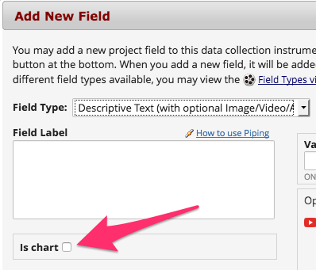
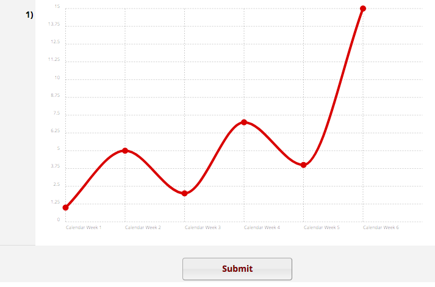

# REDCap Chart Field
Provides a field type for charts by using a library of your choice - [Charts.js](http://www.chartjs.org/) or [Chartist](https://gionkunz.github.io/chartist-js/). Supports Piping on field configuration, so it can be used to display facts to survey participants based on their previous answers.

## Prerequisites
- REDCap >= 8.0.3

## Installation
- Clone this repo into `<redcap-root>/modules/redcap_chart_field_v<version_number>`.
- Go to **Control Center > Manage External Modules** and enable REDCap Chart Field.

## Choosing your chart library
Two amazing chart libraries are supported by this module - Chart.js and Chartist.


## Setting up a chart field (Chart.js example)

This section will walk you through a chart field setup with Piping using Chart.js library.

### Chart source data
The data below represent the source of our chart. Obs.: in this example, the field keys are set as `data_1`, `data_2`, etc (that will be important for Piping later on).


### Creating a chart field
To create a chart field, go throught the usual field creation procedure, this time selecting the new field type provided by this module - Chart.




### Set up chart parameters
Once you select the Chart field type, a few fields will show up on your screen. For this step is really important to get familiar with the documentation of the chart library you chose, since the inputs are expected to be JS objects that follow a syntax defined by the library.

Despite this sounds very technical, no development skills are required to manipulate these parameters - most of cases it is just a matter of copying & pasting pieces of examples from documentation - and minimally adapting them to your case.

Let's create a bar chart from [the main example from Chart.js official documentation](http://www.chartjs.org/docs/latest/#creating-a-chart).

<details><summary>Click to see the code provided by them</summary>

``` html
<canvas id="myChart" width="400" height="400"></canvas>
<script>
var ctx = document.getElementById("myChart").getContext('2d');
var myChart = new Chart(ctx, {
    type: 'bar',
    data: {
        labels: ["Red", "Blue", "Yellow", "Green", "Purple", "Orange"],
        datasets: [{
            label: '# of Votes',
            data: [12, 19, 3, 5, 2, 3],
            backgroundColor: [
                'rgba(255, 99, 132, 0.2)',
                'rgba(54, 162, 235, 0.2)',
                'rgba(255, 206, 86, 0.2)',
                'rgba(75, 192, 192, 0.2)',
                'rgba(153, 102, 255, 0.2)',
                'rgba(255, 159, 64, 0.2)'
            ],
            borderColor: [
                'rgba(255,99,132,1)',
                'rgba(54, 162, 235, 1)',
                'rgba(255, 206, 86, 1)',
                'rgba(75, 192, 192, 1)',
                'rgba(153, 102, 255, 1)',
                'rgba(255, 159, 64, 1)'
            ],
            borderWidth: 1
        }]
    },
    options: {
        scales: {
            yAxes: [{
                ticks: {
                    beginAtZero:true
                }
            }]
        }
    }
});
</script>
```

</details>

Mapping the code above into our configuration fields:

__1. Type:__ Bar

__2. Data__:

``` javascript
{
    labels: ["Red", "Blue", "Yellow", "Green", "Purple", "Orange"],
    datasets: [{
        label: '# of Votes',
        data: [12, 19, 3, 5, 2, 3],
        backgroundColor: [
            'rgba(255, 99, 132, 0.2)',
            'rgba(54, 162, 235, 0.2)',
            'rgba(255, 206, 86, 0.2)',
            'rgba(75, 192, 192, 0.2)',
            'rgba(153, 102, 255, 0.2)',
            'rgba(255, 159, 64, 0.2)'
        ],
        borderColor: [
            'rgba(255,99,132,1)',
            'rgba(54, 162, 235, 1)',
            'rgba(255, 206, 86, 1)',
            'rgba(75, 192, 192, 1)',
            'rgba(153, 102, 255, 1)',
            'rgba(255, 159, 64, 1)'
        ],
        borderWidth: 1
    }]
}
```

__3. Options:__

``` javascript
{
    scales: {
        yAxes: [{
            ticks: {
                beginAtZero:true
            }
        }]
    }
}
```

__4. Canvas width:__ The desired width (in px)

__5. Canvas height:__ The desired height (in px)

Thus, the field creation form looks like that:


Note the highlighted area on image above - Piping is being used in order to dinamically populate the chart data. So each record entry or survey will result in different chart data!

For this particular case - remember the input given on __Chart source data__ section - we have the following result chart:


## Chartist example
In this section we will go through the analogous example for Chartist library, using the same source data - this time drawing a line chart instead.

The process of taking a [Chartist example](https://gionkunz.github.io/chartist-js/#responsive-charts-configuration) as base for configuration is quite similar the previous section.

<details><summary>Click to see the code provided by them</summary>

``` javascript
/* Add a basic data series with six labels and values */
var data = {
  labels: ['1', '2', '3', '4', '5', '6'],
  series: [
    {
      data: [1, 2, 3, 5, 8, 13]
    }
  ]
};

/* Set some base options (settings will override the default settings in Chartist.js *see default settings*). We are adding a basic label interpolation function for the xAxis labels. */
var options = {
  axisX: {
    labelInterpolationFnc: function(value) {
      return 'Calendar Week ' + value;
    }
  }
};

/* Now we can specify multiple responsive settings that will override the base settings based on order and if the media queries match. In this example we are changing the visibility of dots and lines as well as use different label interpolations for space reasons. */
var responsiveOptions = [
  ['screen and (min-width: 641px) and (max-width: 1024px)', {
    showPoint: false,
    axisX: {
      labelInterpolationFnc: function(value) {
        return 'Week ' + value;
      }
    }
  }],
  ['screen and (max-width: 640px)', {
    showLine: false,
    axisX: {
      labelInterpolationFnc: function(value) {
        return 'W' + value;
      }
    }
  }]
];

/* Initialize the chart with the above settings */
new Chartist.Line('#my-chart', data, options, responsiveOptions);
```

</details>

Again, __you don't need to be a developer__ to manipulate this information - it's just a copy & paste work. That's how the code above is mapped into our form fields:

__1. Type:__ Line

__2. Data__:

``` javascript
{
  labels: ['1', '2', '3', '4', '5', '6'],
  series: [
    {
      data: [1, 2, 3, 5, 8, 13]
    }
  ]
}
```

__3. Options:__

``` javascript
{
  axisX: {
    labelInterpolationFnc: function(value) {
      return 'Calendar Week ' + value;
    }
  }
}
```

__3. Responsive options:__

``` javascript
[
  ['screen and (min-width: 641px) and (max-width: 1024px)', {
    showPoint: false,
    axisX: {
      labelInterpolationFnc: function(value) {
        return 'Week ' + value;
      }
    }
  }],
  ['screen and (max-width: 640px)', {
    showLine: false,
    axisX: {
      labelInterpolationFnc: function(value) {
        return 'W' + value;
      }
    }
  }]
]
```

That's how the input on REDCap looks like. Note that the configuration for Chartist is slightly different - there is no canvas dimensions fields, and "Chart responsive options" field is added. Check the official Chartist documentation to understand how it works.

Obs.: width and height have been manually added to __Options__ field to exemplify that is also possible to define chart dimensions with Chartist.


Note that we are using Piping again to make chart data dinamic. And here is the result!


