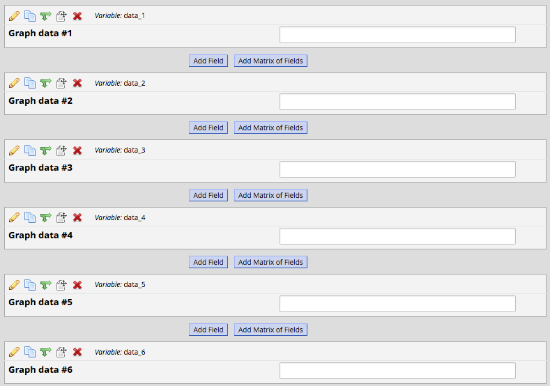
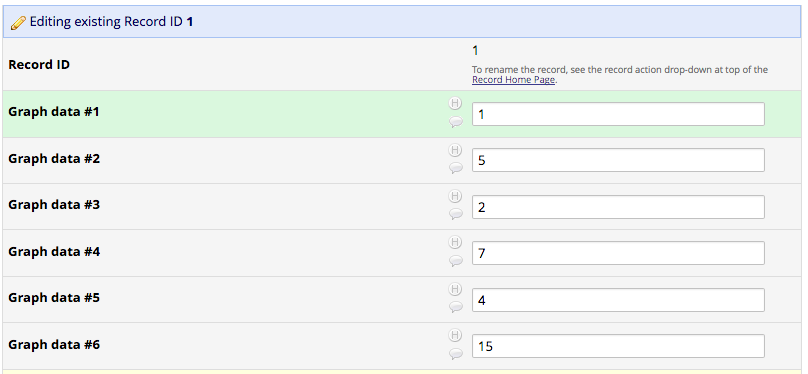
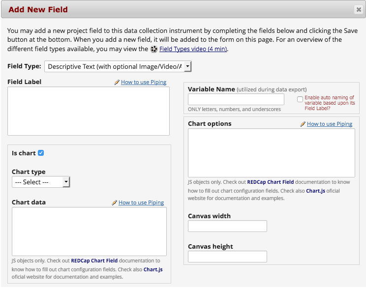
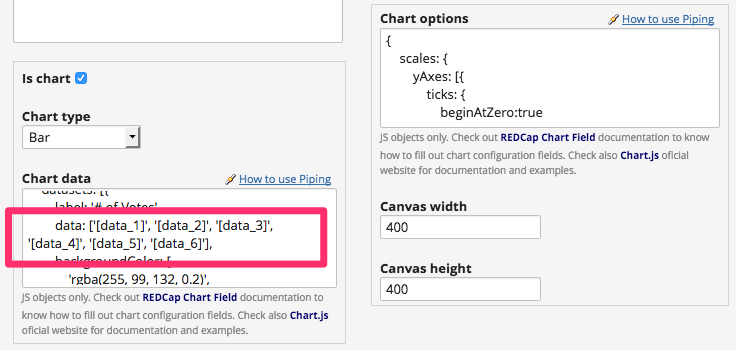
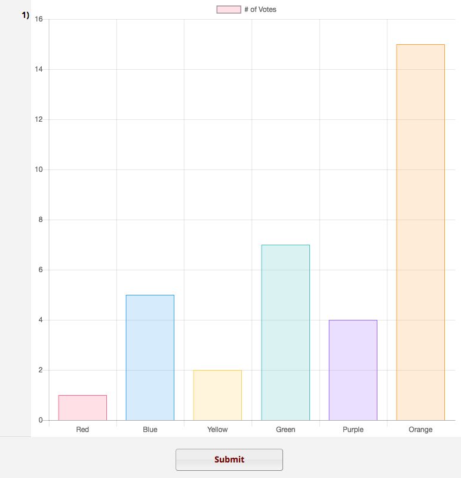
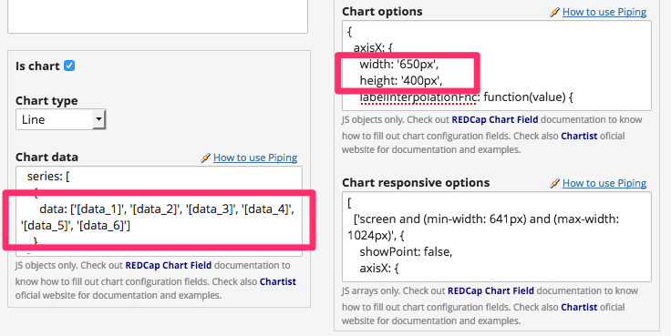

# REDCap Chart Field
Provides a chart drawing feature for data entries and surveys. Integrates REDCap with third-party chart libraries - currently [Charts.js](http://www.chartjs.org/) and [Chartist](https://gionkunz.github.io/chartist-js/) are supported. [Piping](https://redcap.vanderbilt.edu/redcap_v5.5.0/DataEntry/piping_explanation.php) can be used on field configuration, so charts may display facts to survey participants based on their previous answers.

## Prerequisites
- REDCap >= 8.0.3

## Installation
- Clone this repo into `<redcap-root>/modules/redcap_chart_field_v<version_number>`.
- Go to **Control Center > Manage External Modules** and enable REDCap Chart Field.

## Choosing your chart library
Two amazing third-party chart libraries are supported by this module - Chart.js and Chartist.


## Setting up a chart field (Chart.js example)
This section will walk you through a few steps to setup a [Charts.js](http://www.chartjs.org/) chart, dynamically populated via [Piping](https://redcap.vanderbilt.edu/redcap_v5.5.0/DataEntry/piping_explanation.php).

### 1. Setting up source data (for Piping purposes)

The following fields will be used to provide data to populate our chart example. Note the variable names - they will be referenced later on.



To configure a chart it helps to have data in the input fields.  For this example we'll use the data shown here.



### 2. Creating a chart field
To create a chart field, access Online Designer's field creation modal, and then select _Descriptive Text_. You may see a checkbox named _Is chart_.


### 3. Mapping an example provided by the selected third-party library
Once you click on _Is chart_ checkbox, a few extra fields are shown:



To fill these fields out it is very important to get familiar with the documentation provided by the third-party chart library you chose. The inputs are expected to be Javascript objects that follow a particular structure defined by the library. The better you understand the configuration syntax the richer your charts can be.

Though this sounds very technical, no software development skills are required to manipulate these parameters. For most of cases you need only copy & paste a suitable example from documentation.  Then make slight changes to adapt it to your needs.

Let's create a _bar_ chart by using [the main example from Chart.js official documentation](http://www.chartjs.org/docs/latest/#creating-a-chart) as base.

<details><summary>Click to see the code provided by Chart.js website</summary>

``` html
<canvas id="myChart" width="400" height="400"></canvas>
<script>
var ctx = document.getElementById("myChart").getContext('2d');
var myChart = new Chart(ctx, {
    type: 'bar',
    data: {
        labels: ["Red", "Blue", "Yellow", "Green", "Purple", "Orange"],
        datasets: [{
            label: '# of Votes',
            data: [12, 19, 3, 5, 2, 3],
            backgroundColor: [
                'rgba(255, 99, 132, 0.2)',
                'rgba(54, 162, 235, 0.2)',
                'rgba(255, 206, 86, 0.2)',
                'rgba(75, 192, 192, 0.2)',
                'rgba(153, 102, 255, 0.2)',
                'rgba(255, 159, 64, 0.2)'
            ],
            borderColor: [
                'rgba(255,99,132,1)',
                'rgba(54, 162, 235, 1)',
                'rgba(255, 206, 86, 1)',
                'rgba(75, 192, 192, 1)',
                'rgba(153, 102, 255, 1)',
                'rgba(255, 159, 64, 1)'
            ],
            borderWidth: 1
        }]
    },
    options: {
        scales: {
            yAxes: [{
                ticks: {
                    beginAtZero:true
                }
            }]
        }
    }
});
</script>
```

</details>
&nbsp;

Note the sections above labeled _type_, _data_, and _options_.  Those map to the REDCap Chart Field properties _Chart type_, _Chart data_, and _Chart options_, respectively. The _canvas\_width_ and _canvas\_height_ fields map to the _Chart width_ and _Chart height_ REDCap Chart Field properties.

__1. Type:__ Bar
<br>
__2. Data:__

``` javascript
{
    labels: ["Red", "Blue", "Yellow", "Green", "Purple", "Orange"],
    datasets: [{
        label: '# of Votes',
        data: [12, 19, 3, 5, 2, 3],
        backgroundColor: [
            'rgba(255, 99, 132, 0.2)',
            'rgba(54, 162, 235, 0.2)',
            'rgba(255, 206, 86, 0.2)',
            'rgba(75, 192, 192, 0.2)',
            'rgba(153, 102, 255, 0.2)',
            'rgba(255, 159, 64, 0.2)'
        ],
        borderColor: [
            'rgba(255,99,132,1)',
            'rgba(54, 162, 235, 1)',
            'rgba(255, 206, 86, 1)',
            'rgba(75, 192, 192, 1)',
            'rgba(153, 102, 255, 1)',
            'rgba(255, 159, 64, 1)'
        ],
        borderWidth: 1
    }]
}
```

__3. Options:__

``` javascript
{
    scales: {
        yAxes: [{
            ticks: {
                beginAtZero:true
            }
        }]
    }
}
```

__4. Canvas width:__ 400
<br>
__5. Canvas height:__ 400


### 4. Setting up chart properties

Here's how those values look pasted into the REDCap Chart Field properties.



Note the highlighted area on image above - Piping is being used in order to dynamically populate the chart data (`[data_1]`, `[data_2]`, etc) - so each record entry or survey has its own chart results.

Obs.: as the example above, Piping wildcards must be used between quotes (single or double), e.g. `'[data_1]'`.

Note also that piping data from a REDCap field is optional. You could present a chart with static data or use a mix of static and piped data.

### 5. The result
For this particular case - recall the input given on [Chart source data section](#chart-source-data-for-piping-purposes) - we have the following result chart when accessing the field in a survey:



## Analogous example using Chartist
In this section we will go through the analogous example for Chartist library, using the same source data. This time we'll draw a _line_ chart.

The process of mapping a [Chartist example](https://gionkunz.github.io/chartist-js/#responsive-charts-configuration) is  similar to the previous section on Chart.js

<details><summary>Click to see the code provided by Chartist website</summary>

``` javascript
/* Add a basic data series with six labels and values */
var data = {
  labels: ['1', '2', '3', '4', '5', '6'],
  series: [
    {
      data: [1, 2, 3, 5, 8, 13]
    }
  ]
};

/* Set some base options (settings will override the default settings in Chartist.js *see default settings*). We are adding a basic label interpolation function for the xAxis labels. */
var options = {
  axisX: {
    labelInterpolationFnc: function(value) {
      return 'Calendar Week ' + value;
    }
  }
};

/* Now we can specify multiple responsive settings that will override the base settings based on order and if the media queries match. In this example we are changing the visibility of dots and lines as well as use different label interpolations for space reasons. */
var responsiveOptions = [
  ['screen and (min-width: 641px) and (max-width: 1024px)', {
    showPoint: false,
    axisX: {
      labelInterpolationFnc: function(value) {
        return 'Week ' + value;
      }
    }
  }],
  ['screen and (max-width: 640px)', {
    showLine: false,
    axisX: {
      labelInterpolationFnc: function(value) {
        return 'W' + value;
      }
    }
  }]
];

/* Initialize the chart with the above settings */
new Chartist.Line('#my-chart', data, options, responsiveOptions);
```

</details>
&nbsp;

Again, __you don't need to be a developer__ to manipulate this information.  You need only to copy and paste the correct sections of some example code into the appropriate form fields and make some minor edits:

__1. Type:__ Line
<br>
__2. Data:__

``` javascript
{
  labels: ['1', '2', '3', '4', '5', '6'],
  series: [
    {
      data: [1, 2, 3, 5, 8, 13]
    }
  ]
}
```

__3. Options:__

``` javascript
{
  axisX: {
    labelInterpolationFnc: function(value) {
      return 'Calendar Week ' + value;
    }
  }
}
```

__3. Responsive options:__

``` javascript
[
  ['screen and (min-width: 641px) and (max-width: 1024px)', {
    showPoint: false,
    axisX: {
      labelInterpolationFnc: function(value) {
        return 'Week ' + value;
      }
    }
  }],
  ['screen and (max-width: 640px)', {
    showLine: false,
    axisX: {
      labelInterpolationFnc: function(value) {
        return 'W' + value;
      }
    }
  }]
]
```

### Filling out the form:



As we've done on Chart.js section, we are using Piping to make chart data dynamic.

Note that the configuration for Chartist is slightly different - there are no canvas dimension fields, and _Chart responsive options_ field is added. Check the [official Chartist documentation](https://gionkunz.github.io/chartist-js/) to understand how it works.

In our example, width and height are specified to the __Chart options__ field to show that is also possible to define chart dimensions with Chartist.

### The Result

Here is a line chart drawn using Chartist


